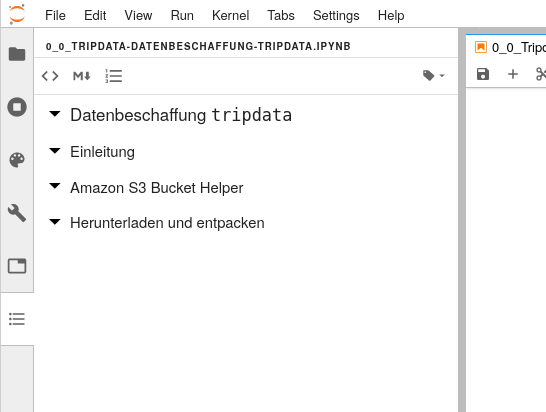

# Semesterarbeiten StatDa und DaVi

Jupyter Notebooks zu den Semesterarbeiten in Statistische Datenanalyse und Datenvisualisierung.

---

Klicken Sie hier [](https://mybinder.org/v2/gh/iwanimsand/ffhs-semarb-statda-davi-public/master?urlpath=lab%2Ftree%2Fnotebooks), um ins Jupyter Lab zu gelangen und die Notebooks auszuführen. 

_(Es kann einen Moment dauern, bis der Container gestartet wurde!)_

---

Wenn Sie sich im Jupyter Lab befinden, nutzen Sie die ```Table of Contents``` Erweiterung, um einfacher in einem Notebook zu navigieren:


